# MAS-project — Group 7

## Project Overview

This Multi-Agent System (MAS) simulates a collaborative robotic mission to decontaminate a radioactive environment. Robots must collect, transform, and transport hazardous waste across three zones of increasing radioactivity ($z_1$ to $z_3$) to a secure disposal area.

Agents operate under **incomplete information**: they have no global knowledge of the environment. Each robot must explore the grid autonomously, discover waste through local observation, and reason from its own accumulated memory.


## Problem Modeling

### 1. Environment & Zones

The environment is a fixed-size grid divided into three radioactive zones from west to east:

| Zone | X range | Radioactivity | Role |
| :--- | :--- | :--- | :--- |
| $z_1$ | $[0,\ \text{width}/3]$ | Low (0.0) | Green waste spawns here |
| $z_2$ | $(\text{width}/3,\ 2\cdot\text{width}/3]$ | Medium (0.5) | Yellow waste deposited here |
| $z_3$ | $(2\cdot\text{width}/3,\ \text{width}-1]$ | High (1.0) | Red waste → Disposal Zone |

Every cell contains a `RadioactivityAgent` marker encoding its zone and level. The easternmost column ($x = \text{width}-1$) additionally carries a `WasteDisposalZone` marker, which red robots detect via local percepts.

### 2. Agent Roles & Capabilities

The system implements a processing pipeline: green waste must be upgraded twice before it can be permanently disposed of.

| Robot type | Zone access | Picks up | Transforms | Deposits |
| :--- | :--- | :--- | :--- | :--- |
| **Green** | $z_1$ only | Green waste | 2 Green → 1 Yellow | Yellow waste anywhere in $z_1$ |
| **Yellow** | $z_1$, $z_2$ | Yellow waste | 2 Yellow → 1 Red | Red waste anywhere in $z_2$ |
| **Red** | $z_1$, $z_2$, $z_3$ | Red waste | — | Disposes at Disposal Zone ($z_3$ east edge) |

Robots can pick up their target waste type **anywhere in their accessible zone** — not only at zone boundaries.


## System Architecture



The project follows a modular MAS structure using a **Percept → Update knowledge → Deliberate → Do** cycle.

### Percept–Deliberate–Do cycle

```
Environment (model.py)
        │
        │  local percepts only
        │  (current cell + 4 neighbours)
        ▼
  ┌─────────────────────────────────┐
  │          Robot agent            │
  │                                 │
  │  Percept → Knowledge → Deliberate│
  │             ↑                   │
  │   explored_map, known_waste,    │
  │   frontier queue, mode          │
  └─────────────────────────────────┘
        │
        │  action dict
        ▼
   model.do()  — validates & executes
        │
        │  fresh percepts
        └──────────────────────────▶ (next step)
```

### Exploration algorithm (Step 1)

Agents discover the environment by maintaining three internal structures:

- **`explored_map`** — set of cells the robot has personally visited.
- **`known_waste`** — dict `{pos: WasteType}` of waste observed locally.
- **`frontier`** — deque of unvisited reachable cells (BFS frontier).

Each step the robot updates these from local percepts, then acts in priority order:

1. Transform (if enough waste in inventory)
2. Deposit (if carrying transformed waste and in the right zone)
3. Pick up (if target waste is in current cell)
4. Navigate via BFS toward the nearest known waste
5. Explore the next cell from the frontier queue
6. Random walk (last resort, within accessible zone)

Navigation between known positions uses **BFS over the explored map**, falling back to a greedy Manhattan step when the path crosses unexplored territory.

### Core Components

**`agents.py`** — Robot agent classes (`GreenRobot`, `YellowRobot`, `RedRobot`) and shared enumerations (`WasteType`, `RobotType`).
- `step_agent()` runs the full percept → knowledge update → deliberate → do loop.
- `deliberate()` is overridden per robot type with the priority logic above.
- `_bfs_next_step()` computes the next move toward a target over the explored map.
- `_update_frontier()` adds newly visible unvisited cells to the exploration queue.

**`objects.py`** — Passive environment entities with no behaviour.
- `RadioactivityAgent` — static marker placed on every cell; encodes zone (1/2/3) and level (0.0–1.0).
- `WasteDisposalZone` — static marker placed on the entire easternmost column; detected by red robots via percepts.

**`model.py`** — Simulation orchestrator.
- Initialises the grid, places all markers, robots, and initial green waste.
- `perceive()` returns **strictly local** observations (current cell + 4 neighbours only — no global waste positions).
- `do()` dispatches and validates actions: `move`, `pick_up`, `transform`, `put_down`, `dispose`.
- `Waste` class lives here (interacts with the Mesa grid directly).

**`run.py`** — Entry point. Runs the simulation, prints step diagnostics, saves plots and CSV data.


## File Structure

```text
numberofthegroup_robot_mission_MAS2026/
├── agents.py    # Robot classes, WasteType enum, BFS exploration logic
├── objects.py   # RadioactivityAgent, WasteDisposalZone
├── model.py     # Grid, Waste class, perceive(), do(), data collection
└── run.py       # Simulation entry point — run this
```

Output directories created automatically on first run:
```text
├── figs/        # robot_mission_results.png
└── results/     # robot_mission_data.csv
```


## How to Run

```bash
# Install dependencies (once)
pip install -r requirements

# Run the simulation
python run.py
```

Parameters can be adjusted at the bottom of `run.py` or by calling `run_simulation()` directly:


## Implementation Phases

**Step 1 — Memory-based autonomous exploration (current)**
Each robot explores the grid independently using a BFS frontier. It discovers waste through local observation and navigates toward known targets using pathfinding over its personal explored map. No global information is shared.

**Step 2 — Inter-agent communication (planned)**
Robots will be able to broadcast discovered waste positions to teammates of the same type, reducing redundant exploration and improving collection efficiency.

**Step 3 — Environmental uncertainties (TBA)**
Handling dynamic events such as new waste appearing mid-simulation, robot failures, or partial zone access changes.