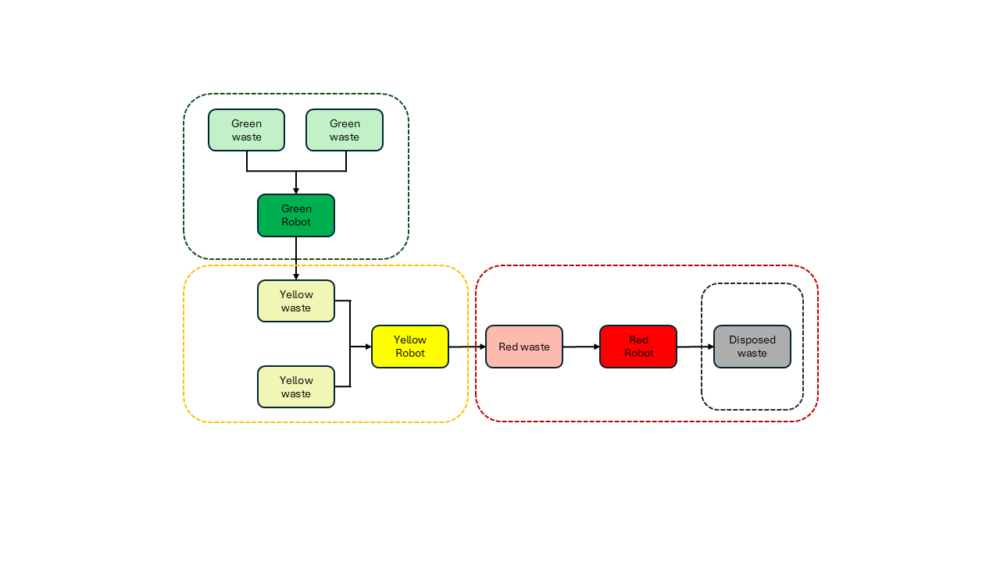
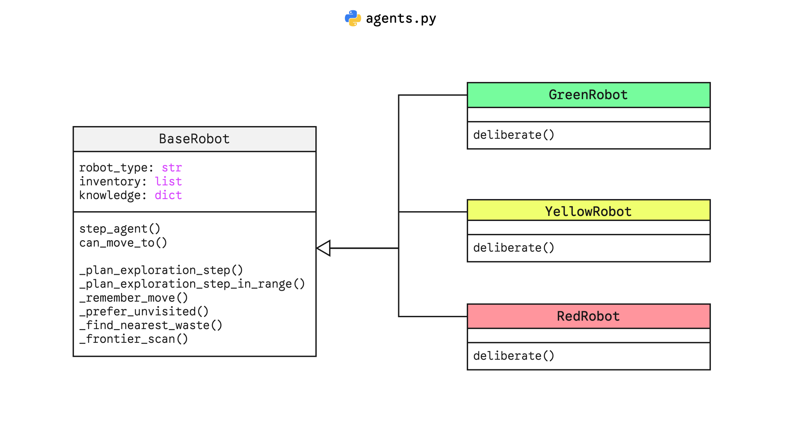
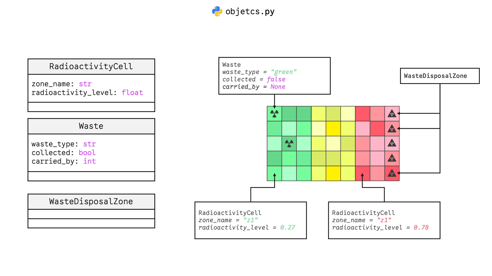

# MAS-project

Welcome to our Multi-Agent Systems project repository! This project was developed as part of the SMA course at CentraleSupélec. This README works as a report for the project where we will explain the problem we are trying to solve, the approach we took (including design choices and algorithms) and the results we obtained.

This project was developed by Group 7: Ouissal Boutouatou, Alae Taoudi & Mohammed Sbaihi.

## Problem Statement
We simulate a hostile (radioactive) environment where a set of robots (agents) must complete the following mission: they must explore the environment, collect waste, transform it and then dispose of it in a safe location.

The environment is divided into three zones: z1, z2 and z3. It also contains a disposal zone where the final transformed waste must be deposited.

There are three types of robots: Green, Yellow & Red robots. Different robot types process different types of waste and have different access to different zones. The table below summarizes the capabilities and zone access for each robot type:

| Robot Type | Capabilities | Zone Access |
|---|---|---|
| Green Robot | Collects green waste (×2), transforms -> 1 yellow, deposits at z1/z2 frontier | z1 only |
| Yellow Robot | Collects yellow waste (×2), transforms -> 1 red, deposits at z2/z3 frontier | z1 + z2 |
| Red Robot | Collects red waste (×1), transports to disposal column | z1 + z2 + z3 |

## Implementation
### Agents

Agents refer to the robots in our simulation, but also to the waste items and radioactivity sources. In other words, the classes we implemented all inherit from the `Agent`class provided by `mesa`. 

#### Robot Agents
Since the three types of robots share a lot of common features, we implemented a `BaseRobot` class from which the three robot types inherit (cf. `agents.py`). This allows us to avoid code duplication and to easily manage the common features of the robots, while still allowing for different deliberation processes for each robot type as you can see in the diagram below.

Robots have three main attributes: `robot_type` (e.g., "Green", "Yellow", "Red"), `inventory` (carried waste) and `knowledge` which stores the robot's knowledge about the environment and about itself. The `knowledge` attribute will be explained in more details later in the report.

#### Waste Agents
Waste items (cf. `Waste` class implementation in `objects.py`) are also implemented as agents and are randomly generated and placed in the environment at the beginning of the simulation. The have three attributes: `waste_type`, `collected` (whether the waste has been collected, for stats and visualization purposes) and `carried_by` (id of the agent currently carrying the waste, if any).

#### Radioactivity Agents
Each cell on the grid contains a `RadioactivityCell` agent. This agent has a `radioactivity_level` attribute (between 0 and 1) which also helps identify the zone of the cell (z1, z2 or z3) stored in the `zone_name` attribute. These agents help Robots identify in which zone they currently are, as no grid frontier information is explicitly given to them.

#### Waste Disposal Agents
`WasteDisposalZone` agents represent the waste disposal part of the environment. They have no attribute.

We summarize these static agents in the diagram below:

### Environment & Model
As you can see in the figure above, the environment is a grid divided into three zones (z1, z2 and z3). We choose a linear division for the sake of simplicity. The disposal zone (set of `WasteDisposalZone` agents)is located at the eastern border of the grid. Each cell of the grid contains a `RadioactivityCell` agent. At the beginning of the simulation, `Waste` agents are randomly generated and placed in the grid, this generation is constrained by the fact that green waste can only be generated in z1, yellow waste in z2 and red waste in z3. The quantity of each waste type is configurable. Robots are also randomly generated and placed in the grid at the beginning of the simulation, constrained by their zone access (e.g., green robots can only be generated in z1 while yellow robots can be generated in z1 and z2).

The model is implemented as `RobotMissionModel` class (cf. `model.py`) which inherits from `mesa.Model`. The model handles the initialization of the environment and the agents (robots, waste etc), perception and action execution. It also handles stats collection.

#### Knowledge & Perception
The perception process is implemented in the `perceive` method of the model. The perceived information contains data about the robot's current cell (e.g., `agent_pos`, `waste_here`, `agents_here`, `radioactivity`etc) but also about the neighbour cells (e.g., `neighbor_waste` and `neighbor_radioactivity`). Note that robots do not perceive any information about the zones frontiers, theis information is inferred from the radioactivity levels of the cells. 

The perceived information is 

